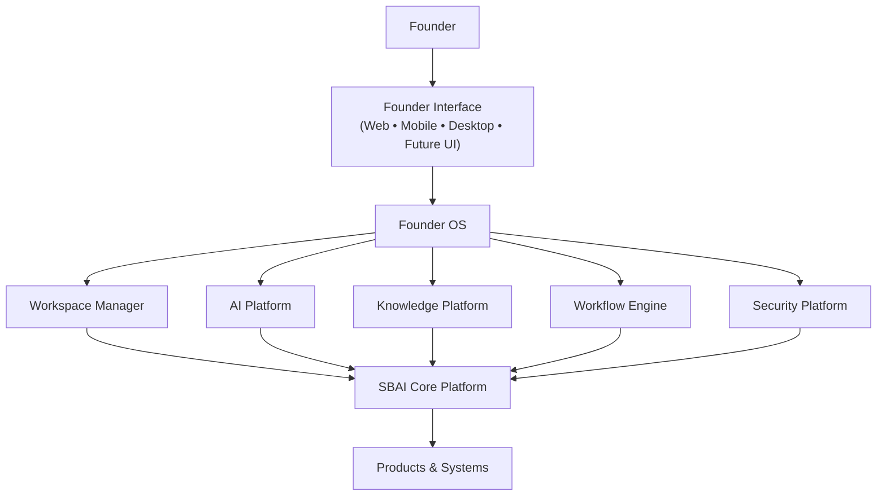

# Founder OS Architecture

## Purpose

This diagram presents the high-level architecture of the SBAI Founder OS.

```mermaid
flowchart TB

Founder["Founder"]

FI["Founder Interface
(Web • Mobile • Desktop • Future UI)"]

FOS["Founder OS"]

WM["Workspace Manager"]

AI["AI Platform"]

KN["Knowledge Platform"]

WF["Workflow Engine"]

SEC["Security Platform"]

CORE["SBAI Core Platform"]

PROD["Products & Systems"]

Founder --> FI
FI --> FOS

FOS --> WM
FOS --> AI
FOS --> KN
FOS --> WF
FOS --> SEC

WM --> CORE
AI --> CORE
KN --> CORE
WF --> CORE
SEC --> CORE

CORE --> PROD
```
